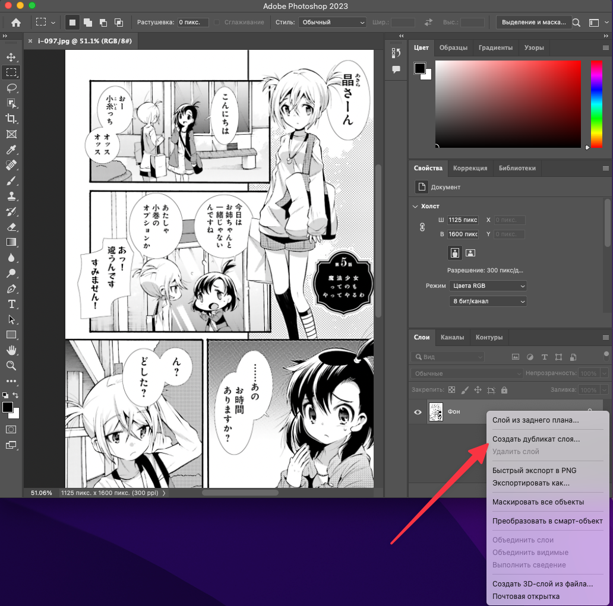
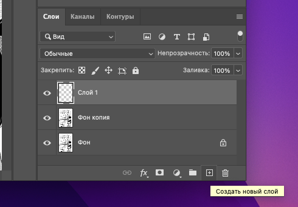
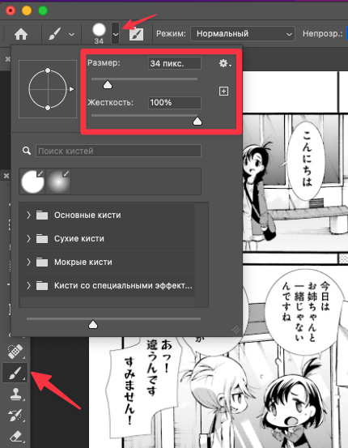
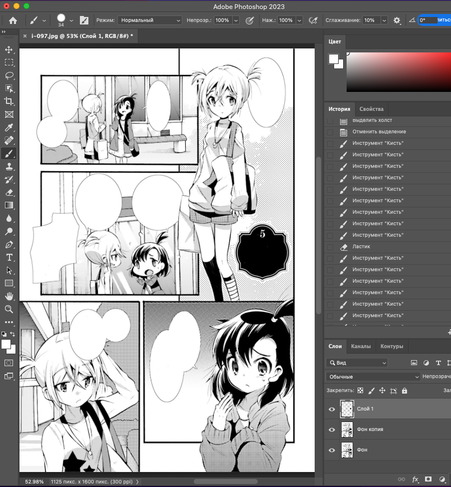
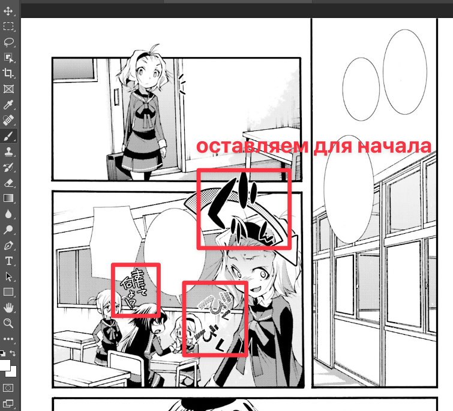
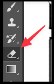

# Чистка скана

Под чисткой понимают стирание всех японских текстов, которые предполагается заменить на перевод.
Но не нужно затирать то, чего нет в переводе (например, это могут быть ничего не значащие вывески на улице). 

Простейший способ избавиться ненужного - закрасить цветом фона. Это хорошо прокатывает с пузырями или надписями на монохромном фоне, но довольно трудно, если текст лежит поверх картинки. На этом этапе достаточно замазать то, что легко замазать.

### 1. Создаем копию фонового слоя и рабочий слой
Копия фонового слоя поможет подсматривать на оригинал в процессе чистки и тайпсета. Кликаем по фоновому слою правой кнопкой и выбираем "Создать дубликат слоя"

Рабочий слой - это пустой слой поверх копии фонового. Именно на нем мы будем закрашивать. Нажимаем на плюсик и перетаскиваем новый слой на самый верх стека.

### 2. Включаем белую кисть
Выбираем слева инструмент с изображением кисти или нажимаем английскую `B` (Brush). Выставите нужную ширину, цвет и максимальную жесткость.

- Изменить ширину кисти
    - Открываем настройки кисти и двигаем ползунок "Размер"
    - Или используем быстрые клавиши `[` и `]`
- Выбрать цвет
    - Выберете на палитре на панели "Цвет" справа
    - Или наведите кисть на место на скане, откуда взять образец цвета, и кликните по нему, удерживая `Alt`
- Изменить жесткость
    - В настройках кисти выставляем жесткость на максимум (100%)

### 3. Закраска
- Убеждаемся, что в стеке слоев выбран рабочий слой (Слой 1)
- Регулируем видимый кадр скана (устанавливаем удобный масштаб)

Далее мазками закрываем оригинальный текст в пузырях. 
    - Если промахнулись - отменяем действие однократным или многократным нажанием на `Ctrl-Z` (отмена).
> Предпочитайте короткие мазки долгому вождению кистью - в случае ошибки отмена действия уберет сразу всю работу.

Если текст вылезает за границу пузыря, то сотрите его тоже - восстановлением пузыря (если это надо) занимаются на последнем шаге. 

Если цвет фона текста другой, меняем цвет - удерживая `Alt` кликаем по образцу цвета на скане. Чтобы вернуть обратно белый, повторяем, кликнув по белому.

Убираем:
- Текст в пузырях
- Текст поверх фона, который легко закрасить

НЕ убираем:
- Надписи поверх картинки, где просто так не закрасить (нужно дорисовывать)
- Содержимое пузыря если в пузыре только вертикальное многоточие или только вертикальная линия

### 4. Исправления
Если замазали слишком много, используем ластик. Для перехода в режим ластика нажимаем английское `E` (Eraser). Ласти похож на кисть (у нее тоже можно менять толщину/жесткость и тп), но он стирает все, что нарисовано на выбранном слое. То есть, __обязательно убедитесь, что у вас выбран рабочий слой__. 

### 5. Сохранение
Через меню "Файл" → "Сохранить" или клавишами `Ctrl+S`. Несмотря на то, что исходный файл был PNG, Фотошоп предложит сохранить его в своём редактируемом формате PSD, и это правильно. Обычно автоматом предлагается сохранить в той же папке, откуда открыли исходные PNG файл.  
Если фотошоп спросит про максимизацию совместимости, жмём ОК (можно поставить внизу галку "Больше не показывать")

## Если происходит что-то странное

### Кисть не рисует
- Убедитесь, что никакая часть скана не под выделением (для этого нажмите `Ctrl+D` или в верхнем меню выберите "Выделение"  →  "Отменить выделение")
- Убедитесь, что вы находитесь на рабочем слое, и что он выше фона
    - Кликните по слою, что находится над копией фона.
- Проверьте ширину кисти и цвет
- Проверьте видимость рабочего слоя (значок с глазом должен показываться)