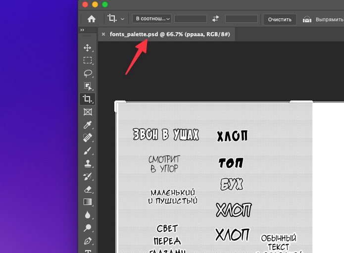

## 1. Рабочая шара (на примере Oriko Sadness Prayer)

Мы используем общие папки Dropbox или Яндекс.Диск. Для Орико это Dropbox, где нужно будет создать аккаунт, [установить на приложение](https://www.dropbox.com/install). После этого на компьютере появится папка Dropbox, в которую будет синхронизироваться общая папка. **oriko_sp**
Сразу эта папка не появится, потому что её нужно будет добавить (попросить админа прислать специальную ссылку и перейти по ней).  
После выполнения всех процедур, в Dropbox на компе появится общая папка **oriko_sp**, выглядящая примерно так:

- сh05/, ch06/... папки со сканами еще не сделанных глав
- fonts/ - шрифты
- translations/ - текстовые скрипты 

Сохранять PSD файлы можно прямо в chXX/ папках рядом с исходными png файлами. Сохраненные файлы автоматически синхронизируются в Dropbox. 

## 2. Шрифты
У каждой команды свой любимый набор шрифтов, которые они как-то приспосабливают к своей манге. Так или иначе, шрифты надо установить в системе и папки со шрифтами. После этого они станут доступны для выбора в Фотошопе, и он не будет ругаться на отсутствующие шрифты, когда вы будете открывать редактированные другими PSD файлы.

## 3. Палитра образцов текста
Удобно расположить файл палитры образцов текста слева от рабочего окна Фотошопа. Для этого открываем в Фотошопе файл **fonts_palette.psd**, уменьшаем ширину окна до половины экрана, зажимаем мышью таб файла и "вытаскиваем" его из окна наружу и отпускаем слева. Можно подогнать размеры нового окна и масштаб. 

После чего можно открыть скан в Фотошопе
> Если скан откроется слева, а не справа, просто перетащите таб скана в главное окно, прицеливая мышь в самую верхнюю часть пустого окна фотошопа (тогда окошко скана "приклеится" туда)

В конце концов должно получиться что-то вроде такого
