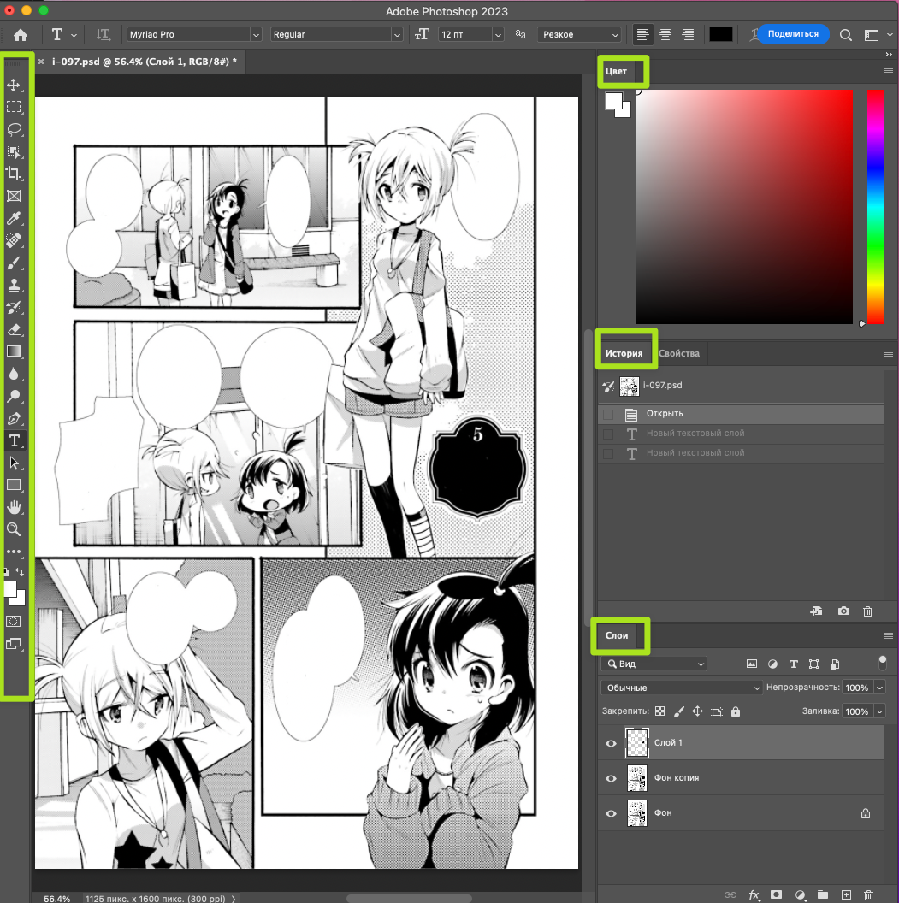

# Фотошоп на минималках

## Панели инструментов
Нам понадобится совсем немного инструментов, так что заранее можно убрать ненужные панели. Можно перетаскивать панели, хватаясь мышью за их верхние ярлыки, закрывать из через меню правой кнопки. А если какой-то панели не хватает или закрыли по ошибке, открыть ее снова можно по названию в меню `Окно`.

## Базовые операции
* Открыть новый файл

В случае файла формата Фотошопа (.psd) открывается двойным кликом по нему. Для jpg, png и др. форматов изображений, загрузить файл в Фотошоп можно через контектстное меню "Открыть в..." или из самого Фотошопа через меню `Файл -> Открыть`
* Отмена действия
    * `Ctrl+Z` один или несколько раз
    * Можно также кликать по действиям на панели "История"
* В любой непонятной ситуации, когда надо что-то выключить/закрыть/выйти
    * Попытайтесь нажимать `Esc` 
    * Попытайтесь нажать `Ctrl+Enter`, а затем отменить
* Масштаб
    * `Ctrl + Num+` и `Ctrl + Num-`
    * Удерживая `Alt`, вращать колесо мыши
* Сохранить
    * `Ctrl+S` 
    * Или через верхнее меню `Файл -> Сохранить`